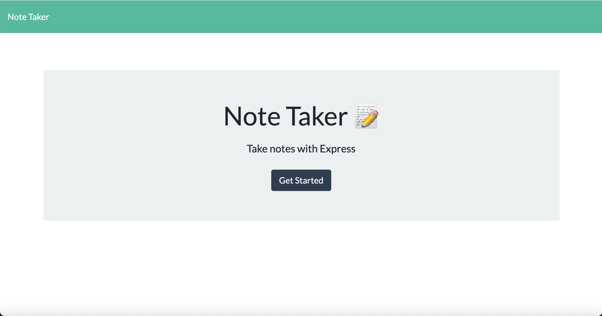
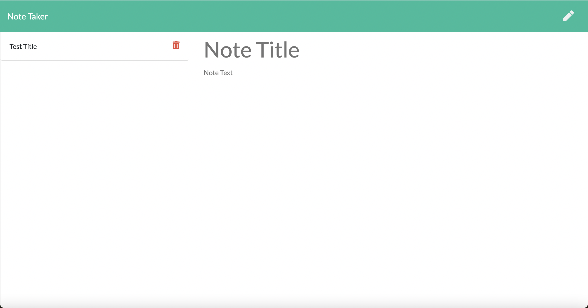
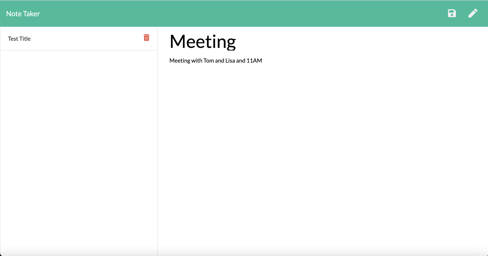
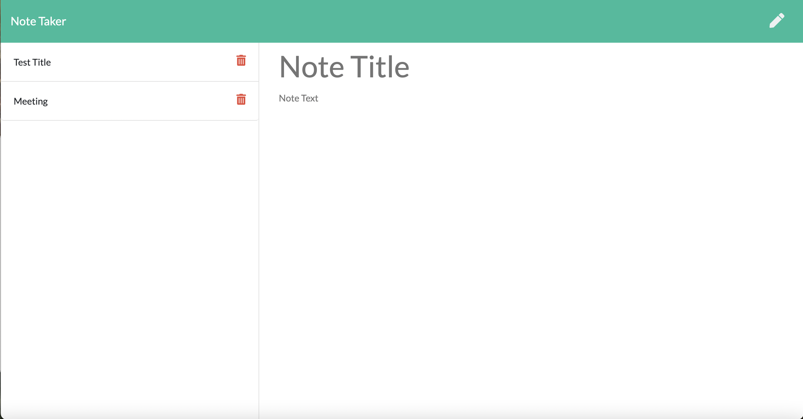

# Note-Taker
An application that can write and save notes.

## About

The Note Taker that can be used to write and save notes. This application uses an Express.js back end and saves and retrieves note data from a JSON file.

## Application

[Note Taker Link](https://neilcreveling.github.io/Note-Taker/)

Upon opening the link, the user is presented with an introductory page with a button that will send the user to the note taking page.

Upon opening the note page, the interface shows the right hand side where saved notes are displayed (currently there is a test card there to provide context) and central text area to write their own note with a title and content.

This example shows how content appears on the interface when entered by a user.

After clicking the save button in the upper right hand corner, the note will be added to the note list on the left hand side of the page. The user can click on the saved notes to view their content. Currently the delete button is not functioning, but that function will be developed in the future.

## License

MIT License

Copyright (c) 2021 Neil Creveling

Permission is hereby granted, free of charge, to any person obtaining a copy of this software and associated documentation files (the "Software"), to deal in the Software without restriction, including without limitation the rights to use, copy, modify, merge, publish, distribute, sublicense, and/or sell copies of the Software, and to permit persons to whom the Software is furnished to do so, subject to the following conditions:

The above copyright notice and this permission notice shall be included in all copies or substantial portions of the Software.

THE SOFTWARE IS PROVIDED "AS IS", WITHOUT WARRANTY OF ANY KIND, EXPRESS OR IMPLIED, INCLUDING BUT NOT LIMITED TO THE WARRANTIES OF MERCHANTABILITY, FITNESS FOR A PARTICULAR PURPOSE AND NONINFRINGEMENT. IN NO EVENT SHALL THE AUTHORS OR COPYRIGHT HOLDERS BE LIABLE FOR ANY CLAIM, DAMAGES OR OTHER LIABILITY, WHETHER IN AN ACTION OF CONTRACT, TORT OR OTHERWISE, ARISING FROM, OUT OF OR IN CONNECTION WITH THE SOFTWARE OR THE USE OR OTHER DEALINGS IN THE SOFTWARE.
